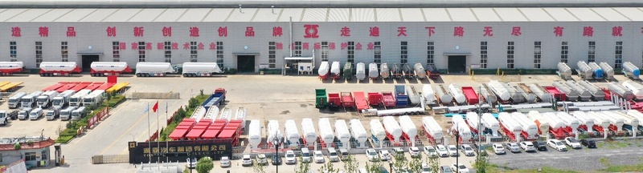

# 📸 图片下载与替换指南

## 从通亚官网获取图片

### 通亚官网地址
- **主站**: http://www.chinatongya.com
- **英文版**: http://www.chinatongya.com/en (如果有)
- **产品页**: http://www.chinatongya.com/product

---

## 📥 下载步骤

### 方法1: 直接下载 (推荐)

1. **访问通亚官网产品页**
   ```
   http://www.chinatongya.com/product
   ```

2. **右键保存图片**
   - 在想要下载的图片上右键
   - 选择 "图片另存为..."
   - 保存到本项目的 `assets/images/` 文件夹

3. **推荐下载的图片**

#### 首页需要 (index.html)
| 位置 | 建议图片 | 文件名建议 |
|------|----------|-----------|
| 通亚工厂卡片 | 工厂外观/大门 | `tongya-factory.jpg` |
| 产品分类图标 | 可用图标代替 | 无需图片 |

#### 工厂页面需要 (factories/tongya.html)
| 位置 | 建议图片 | 文件名建议 |
|------|----------|-----------|
| 工厂主图 | 工厂全景/鸟瞰图 | `tongya-hero.jpg` |
| 产品图片 - 平板车 | 40ft flatbed trailer | `flatbed-40ft.jpg` |
| 产品图片 - 低平板 | 60 ton lowbed | `lowbed-60ton.jpg` |
| 产品图片 - 油罐车 | 45000L fuel tanker | `tanker-45000l.jpg` |
| 产品图片 - 自卸车 | Rear dump trailer | `dump-rear.jpg` |
| 工厂图库 | 生产线/焊接车间 | `gallery-1.jpg` ~ `gallery-6.jpg` |

---

### 方法2: 使用开发者工具批量下载

如果官网图片较多，可以使用浏览器开发者工具：

1. **按 F12 打开开发者工具**
2. **切换到 Network (网络) 标签**
3. **刷新页面**
4. **筛选图片**: 点击 "Img" 过滤器
5. **右键保存**: 在列表中找到想要的图片，右键 → Open in new tab → 保存

---

### 方法3: 使用下载工具

如果需要下载大量图片，可以使用：

#### 浏览器扩展
- **Image Downloader** (Chrome)
- **Imageye** (Chrome)
- **Fatkun图片批量下载** (Chrome)

#### 命令行工具 (适合技术人员)
```bash
# 安装 wget
brew install wget

# 下载整个图片目录 (替换为实际的图片URL模式)
wget -r -np -nH --cut-dirs=2 -A.jpg -A.png http://www.chinatongya.com/images/
```

---

## 🖼️ 图片处理建议

### 尺寸规范

| 用途 | 建议尺寸 | 格式 | 大小限制 |
|------|----------|------|----------|
| 首页工厂卡片 | 600x400px | JPG | < 100KB |
| 工厂主图 | 1200x800px | JPG | < 200KB |
| 产品图片 | 800x600px | JPG | < 150KB |
| 图库照片 | 600x400px | JPG | < 100KB |

### 图片优化工具

#### 在线工具 (推荐)
- **TinyPNG**: https://tinypng.com (压缩PNG/JPG)
- **Squoosh**: https://squoosh.app (Google出品，精细控制)
- **ImageOptim**: https://imageoptim.com (在线版)

#### Mac本地工具
```bash
# 安装 ImageMagick
brew install imagemagick

# 批量调整大小
magick mogrify -resize 800x600 -quality 85 *.jpg

# 批量压缩
magick mogrify -strip -interlace Plane -quality 85 *.jpg
```

---

## 📝 替换步骤

### 1. 创建图片目录

```bash
mkdir -p /Users/alan/Work/trailer-matrix/website-v2/assets/images
```

### 2. 放入下载的图片

将下载好的图片放入 `assets/images/` 文件夹

### 3. 修改HTML引用

#### 首页 index.html 修改示例:

**原代码 (第143-148行):**
```html
<div class="factory-image">
    <div class="factory-badge">Exclusive Partner</div>
    <div class="factory-placeholder">
        <i class="fas fa-industry"></i>
    </div>
</div>
```

**修改为:**
```html
<div class="factory-image">
    <div class="factory-badge">Exclusive Partner</div>
    
</div>
```

#### 工厂页面 factories/tongya.html 修改示例:

**原代码 (第156-160行):**
```html
<div class="factory-hero-image">
    <i class="fas fa-industry"></i>
    <p style="margin-top: 1rem; opacity: 0.7;">Factory Photo Placeholder</p>
</div>
```

**修改为:**
```html
<div class="factory-hero-image">
    
</div>
```

**产品卡片修改 (第201-206行):**
```html
<!-- 原代码 -->
<div class="product-image">
    <span class="product-badge">Hot Sale</span>
    <div class="placeholder">
        <i class="fas fa-truck-flatbed"></i>
    </div>
</div>

<!-- 修改为 -->
<div class="product-image">
    <span class="product-badge">Hot Sale</span>
    
</div>
```

---

## 🎨 图片风格建议

### 色调统一
- 通亚工厂图片通常以 **蓝色** 为主色调
- 选择明亮、清晰的图片
- 避免模糊或过暗的照片

### 图片类型优先级

1. **产品实物图** (最重要)
   - 侧面45度角展示
   - 白色或干净背景
   - 清晰展示产品特点

2. **工厂实景图**
   - 工厂大门/招牌
   - 生产车间
   - 成品停车区

3. **细节图**
   - 焊接工艺
   - 喷涂工艺
   - 关键部件

---

## ⚠️ 注意事项

### 版权问题
- 通亚官网图片通常可以使用 (你们是合作伙伴关系)
- 建议邮件确认: `sales@chinatongya.com`
- 邮件模板:
  ```
  Subject: Request to Use Product Images for African Marketing
  
  Dear Tongya Team,
  
  We are preparing marketing materials for African customers and would 
  like to use product images from your website www.chinatongya.com.
  
  Could you please confirm if we can use these images for our website 
  and promotional materials?
  
  Best regards,
  [Your Name]
  China Africa Trucks
  ```

### 图片质量
- **最低分辨率**: 800x600px
- **格式**: JPG (照片), PNG (透明背景)
- **避免**: 有水印、模糊、过小的图片

### 加载速度
- 单张图片 < 200KB
- 使用 lazy loading (已配置)
- 首页首屏图片优先加载

---

## 🚀 快速开始

### 最少需要的图片 (MVP)

为了快速上线，最少需要以下 **5张图片**:

1. **tongya-factory.jpg** - 工厂外观 (首页用)
2. **flatbed-40ft.jpg** - 40英尺平板车
3. **lowbed-60ton.jpg** - 60吨低平板
4. **tanker-45000l.jpg** - 45000升油罐车
5. **tongya-hero.jpg** - 工厂大图 (工厂页面用)

### 推荐总图片数

| 阶段 | 图片数量 | 说明 |
|------|----------|------|
| MVP | 5张 | 快速上线 |
| 基础 | 15张 | 每个产品1张 + 工厂5张 |
| 完整 | 30张+ | 每个产品多角度 + 完整工厂展示 |

---

## 📝 下一步行动

1. ✅ 访问 http://www.chinatongya.com
2. ✅ 下载5张核心图片
3. ✅ 放入 `assets/images/` 文件夹
4. ✅ 修改HTML引用 (参考上面的示例)
5. ✅ 压缩图片 (使用 TinyPNG)
6. ✅ 测试网站加载速度
7. ✅ 推送到GitHub

需要我帮你执行哪一步？或者你有从通亚获取的图片，我可以帮你修改HTML代码来引用它们。